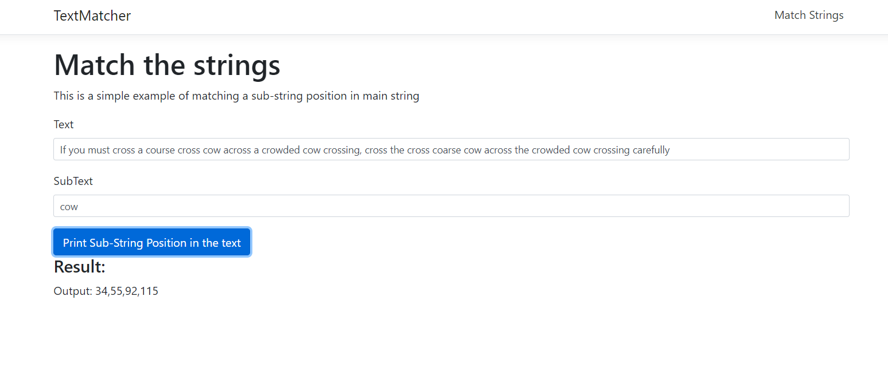

# TextMatcher
This is a web application to match a sub-string and output it's start character positions against an main input string/text.

The application is built with Angular 7 and .NET Core 3.1 and also include unit test cases.

Example: 
